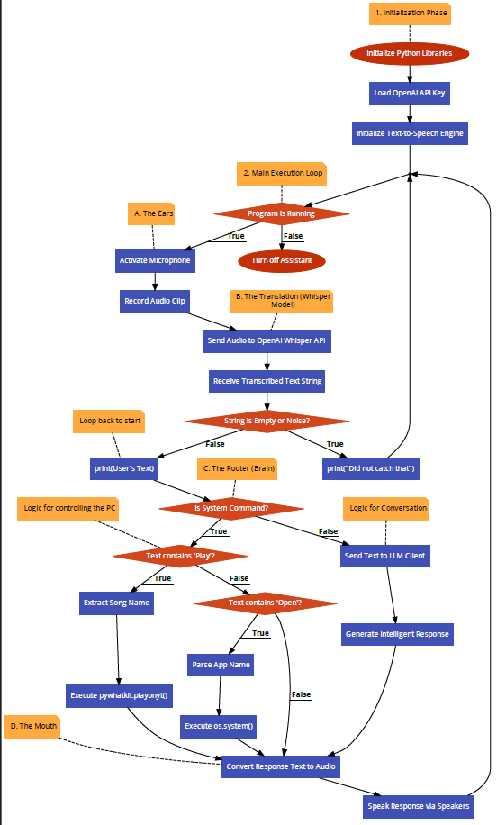

# 🧠 Local Edge Voice Agent (Project Jarvis)


An **offline, privacy-preserving Voice User Interface (VUI)** that processes speech, logic, and intelligence entirely on local hardware. 

Unlike cloud-based assistants (Alexa/Siri), this project demonstrates an **Edge AI architecture**, utilizing **OpenAI Whisper** for speech recognition and **Meta's Llama 3.2** for general intelligence, decoupled from the internet. It features a reactive GUI that visualizes agent states (Sleeping, Listening, Thinking) in real-time.


---

## 📸 Project Demo
[](https://youtu.be/WNcnS0Yb1pk)

## 🚀 Key Features

* **🔒 100% Offline Privacy:** All audio processing and inferencing happen locally on the CPU.
* **🧠 Local LLM Brain:** Integrated with **Ollama (Llama 3.2)** to handle complex, open-ended conversations.
* **⚡ Multi-Threaded Architecture:** Decoupled the **GUI (Main Thread)** from the **Inference Engine (Worker Thread)** to prevent freezing during heavy computation.
* **🗣️ Continuous Conversation:** Implements a "Wake-and-Sustain" logic loop that listens for commands and auto-sleeps after 5 seconds of inactivity.
* **🎨 Dynamic GUI:** Event-driven Tkinter interface that swaps visual assets based on the agent's internal state machine (Wake/Sleep/Think).
* **💻 OS Automation:** Capable of executing system commands (Opening apps, YouTube, System Time) via direct OS subprocess calls.

---

## 🏗️ System Architecture

The system follows a standard **Wake-Listen-Think-Act** pipeline optimized for consumer hardware.



### Data Flow Breakdown:
1.  **Input Stage:** `SpeechRecognition` library monitors audio stream for the Wake Word ("Jarvis").
2.  **ASR Stage:** `OpenAI Whisper (Base)` model converts audio tensor to text.
3.  **Router:**
    * **Deterministic Path:** Simple commands (e.g., "Open Notepad") trigger Python functions immediately.
    * **Probabilistic Path:** Complex queries (e.g., "Why is the sky blue?") are sent to the local LLM.
4.  **Output Stage:** PowerShell's SAPI5 engine is invoked via `subprocess` for non-blocking Text-to-Speech.

---

## 🛠️ Installation & Setup

### 1. Prerequisites
* **Python 3.10+**
* **FFmpeg** (Must be installed and added to System PATH).
* **Ollama:** Download from [ollama.com](https://ollama.com) and install.

### 2. Setup the Brain
Open your terminal and pull the lightweight Llama 3.2 model:
```bash
ollama run llama3.2
# Type /bye to exit once it loads
